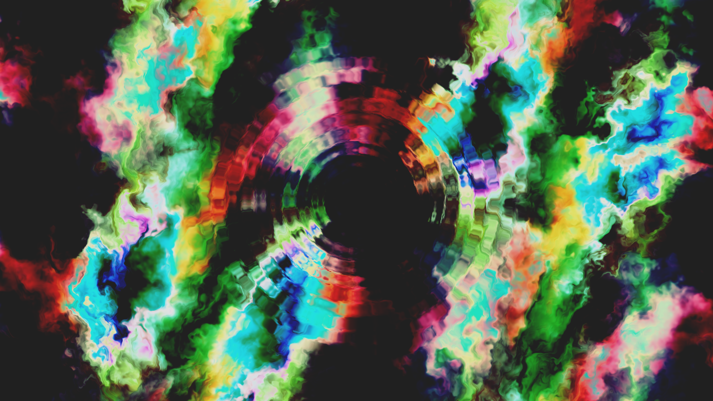

# Unity-OpenBCI
This repo introduces how to integrate FBM into Unity.

[Vimeo](https://vimeo.com/301140396)
## Fractional Brownian Motion
> Warping, or dommain distortion is a very common technique in computer graphics for generating procedural textures and geometry. 

[Ref](http://iquilezles.org/www/articles/warp/warp.htm)
